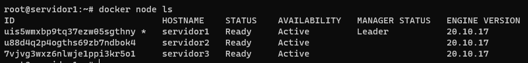

# Docker: Utilização Prática no Cenário de Microsserviços

> Denílson Bonatti
>
> Linux Experience
>
> 26/08/2022


Aplicações em Bare Metal (servidor dedicado) até a conteinerização em nuvem pública.


> Guia Melzinho na Chupeta
>
> https://github.com/denilsonbonatti/toshiro-shibakita


> Maior desvantagem de um servidor local é o custo.


Problemas com a nuvem privada

- Dificuldades com a segurança da Tecnologia da Informação (lógica (firewall) e física (acesso físico, temperatura do ar condicionado, nem frio e nem calor demais))
- Custo com mão de obra especializada
- Custo de Hardware
- Custo de Energia elétrica
- Falta de energia (uso de geradores)
- Despesas inesperadas


Vantagens de migrar para a nuvem pública

- Preço (pague somente o que usar)
- facilidade de contratação, configuração e infraestrutura 
- Escalabilidade
- Performance


Aplicação monolítica x arquitetura microsserviços


## Microsserviços

arquitetura inovadora

consiste em construir aplicações desmembrando-as em serviços independentes. 

Estes serviços se comunicam entre si usando APIs. (com JSON)

Promovem grande agilidade em times de desenvolvimento.

Gigantes, como Netiflix e Spotify, transformaram suas aplicações monolíticas em +500 microsserviços.


Quando quebramos uma aplicação monolítica em várias pequenas partes, conseguimos escalá-las de forma separada.

Supondo que um serviço de autenticação seja chamado várias vezes durante a sessão de um usuário, com certeza o estresse sobre ele é maior. Com microsserviços podemos escalar apenas essa parte, invés de escalar como um todo (o que ocorre na arquitetura monolítica)


Microsserviços não necessariamente precisam ser escritos usando a mesma linguagem, pois eles se comunicam através de API.


## O que é um Cluster e Docker Swarm?

### Cluster

aglomerado

computadores ligados que trabalham em conjunto, em muitos aspectos é como se fossem um único sistema.

Computadores em cluster executam a mesma tarefa, controlado e programado por software.

Cada computador no cluster é um nó (node).


### Docker Swarm

Swarm: recurso do Docker

fornece funcionalidades de orquestração de contêiner , incluindo clustering nativo de hosts do Docker e agendamento de cargas de trabalho de contêineres.

Um grupo de hosts do Docker formam um cluster "Swarm".


Se algum nó tiver falha, outro assume automaticamente.


## Entendendo as definições do primeiro container

As imagens de contêineres ficam no https://hub.docker.com/


> Ao subir o contêiner, já podemos configurar variáveis de ambiente, usuários, tabelas entre outros.


Para instalar `mysql` em um contêiner docker:

```bash
docker run --name mysql-A -d -p 3306:3306 -e MYSQL_ROOT_PASSWORD=Senha123 -e MYSQL_DATABASE=meubanco --mount type=volume,src=data,dst=/var/lib/mysql mysql:5.7
```


Para instalar o  `alpine` em um contêiner docker:

> `alpine` = apache + Linux + PHP7

```bash
docker run --name web-server -dt -p 80:80 --mount type=volume,src=app,dst=/app/ webdevops/php-apache:alpine-php7
```

`-d`  Indica que o serviço será executado em segundo plano.

`-t` Cria um prompt de comando para acessar o contêiner.


> Os arquivos ficam dentro do diretório `_data` montado no volume.
>
> `/var/lib/docker/volumes/data/_data#`
>
> `/var/lib/docker/volumes/app/_data#`


> Ao recriar o contêiner `mysql` com os dados de acessos modificados, é necessário apagar os arquivos que ficaram no volume:
>
> ```bash
> docker volume prune
> ```


> Na AWS é necessário liberar as portas no Firewall;


## Estressando o container

Utilizado para saber se a aplicação vai suportar a carga.

> Loader
>
> https://loader.io/


Aplicamos o teste e verificamos os gráficos, se em algum momento a aplicação começar a demorar muito a responder a requisição, significa que o contêiner está estressado e que precisa ser duplicado.


## Iniciando um cluster Swarm

Caso o sistema esteja estressado, podemos duplicar os contêineres.


> Aparentemente, é necessário remove o contêiner antes de criarmos o cluster.
>
> ```bash
> docker rm --force web-server
> ```
>


Para iniciar um cluster:

```bash
docker swarm init
```


> O IP `192.168.0.101:2377` é um IP local para comunicação entre as máquinas virtuais.

> Pode ser necessário liberar a porta `2377` no Firewall.


Para adicionarmos os outros servidores como nós, execute o comando indicado no passo anterior em todas as máquinas que serão incluídas.

```bash
docker swarm join --token SWMTKN-1-21pchn9iptpxwtktsgzh9cmag9z0h2wnkmbwnkt80vplk0zrkt-avps0ehoe18lf8kjt2p2phaio 192.168.0.101:2377
```


## Criando um serviço no cluster

Para checar os nós pertencentes ao cluster.

```bash
docker node ls
```

Este comando funciona somente no nó gerenciador (manager)


Para criar um serviço de contêineres.

Serão replicados dentro do cluster, dentro das máquinas virtuais.

```bash
docker service create --name web-server --replicas 10 -dt -p 80:80 --mount type=volume,src=app,dst=/app/ webdevops/php-apache:alpine-php7
```

`--replicas 10` numero de réplicas

> Será criado 10 réplicas do contêiner que serão distribuída nas 3 máquinas.


Para verificar onde foi aplicado os conteineres.

```bash
docker service ps web-server
```


> O cluster não replica o conteúdo do volume.
>
> O local do volume foi definido como `cd /var/lib/docker/volumes/app/_data/`.
>
> Havia conteúdo no primeiro servidor colocado anteriormente. Quando foi feito o cluster e a réplica, esse conteúdo não foi replicado.


## Replicando um volume dentro do cluster

Para replicar o conteúdo, podemos utilizar o servidor `nfs-server`.

O primeiro será o servidor e as demais máquinas serão os clientes. Na primeira maquina instalamos o `nfs-server`:

```bash
apt-get install nfs-server
```


Nas outras máquinas, que serão clientes , instalamos o `nfs-common`:

```bash
apt-get install nfs-common
```


Para configurar a replicação de arquivos, precisamos editar o arquivo `/etc/exports` na máquina que está como servidora do `nfs-server` . Neste arquivo adicionamos o caminho do diretório que queremos liberar.

```text
/var/lib/docker/volumes/app/_data *(rw,sync,subtree_check)
```


> O ideal é definir o IP para quem será liberado, mas no exemplo, está liberado geral.
>
> rw = gravar, sync = sincronizar, subtree_check = subpastas incluídas.


Para exportar o diretório

```bash
exportfs -ar
```


Para checar o diretório que está sendo compartilhado

```bash
showmount -e
```


Para montar o diretório nas máquinas clientes

```bash
mount -o v3 192.168.0.101:/var/lib/docker/volumes/app/_data /var/lib/docker/volumes/app/_data
```

`192.168.0.101:/var/lib/docker/volumes/app/_data` IP da máquina servidor e o local compartilhado.

`/var/lib/docker/volumes/app/_data` local onde será montado

> `v2` não funciona no Ubuntu.

> Com Infraestrutura como código poderíamos criar um grande código para executar tudo de uma vez.


## Criando um proxy utilizando o NGINX

> Uma requisição feita a primeira máquina será replicada para todas as outras máquinas.
>
> Pode ser feita por um serviço contratado na AWS ou usando um proxy interno (`nginx`) no container 1.


Criamos um diretório `/proxy` para colocar as configurações que indicam quais máquinas que pertencem ao proxy.

Nesse arquivo indicamos o IP das máquinas.

```bash
mkdir /proxy
nano nginx.conf
```


`listen 4500` é a porta por onde o proxy será acessado.

Ao fazer a requisição para o primeiro servidor pela porta 4500, ele saberá que precisa replicar para as outras máquinas.

Este arquivo de configuração precisa estar dentro do contêiner do proxy.


Para facilitar, podemos criar um dockerfile para executar essa ação

```bash
nano dockerfile
```

```bash
# imagem
FROM nginx
# arquivo que será copiado
COPY nginx.conf /etc/nginx/nginx.conf
```


Para montar a imagem com a configuração definida no dockerfile:

```bash
docker build -t proxy-app /proxy/.
```

`.` indica para pegar o dockerfile


> Muitas coisas podem ser configuradas no dockerfile


Para executar o conteiner a partir da imagem criada:

```bash
docker container run --name my-proxy-app -dti -p 450
0:4500 proxy-app
```

`container`  é opcional nesse caso.

> Esse proxy não é replicado nas outras máquinas. Fica apenas no primeiro.


## Estressando o cluster

Usamos o `loader.io` novamente, mas agora passamos a porta `4500` definida no proxy e o IP é o da primeira máquina (onde está o proxy).


Para saber se está funcionando, podemos checar os logs do contêiner ou analisar os dados da coluna host definida no banco de dados.

> O proxy será responsável por fazer o balanceamento das requisições entre máquinas e contêineres.


> Com IaC ou utilizando recursos do AWS, poderíamos configurar para que se o processador chegasse a determinado valor para automaticamente criar um cluster com 2 máquinas.


